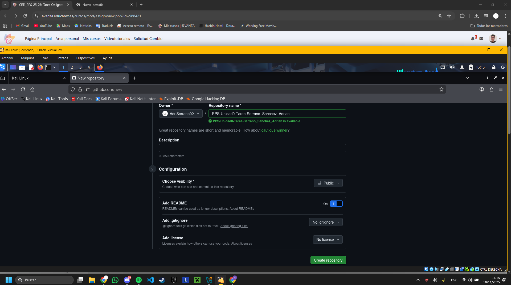

# Gestión con Git

## Creación del Repositorio

### Paso 1: Crear repositorio en GitHub
- Accedí a GitHub.com y creé un nuevo repositorio llamado `PPS-Unidad0-Tarea-Serrano_Sanchez_Adrian`
- Configuré el repositorio como público
- Inicialicé con un README.md



### Paso 2: Clonar el repositorio localmente
```bash
git clone https://github.com/AdriSerrano02/PPS-Unidad0-Tarea-Serrano_Sanchez_Adrian.git
cd PPS-Unidad0-Tarea-Serrano_Sanchez_Adrian
```

### Paso 3: Crear repositorio en GitHub
Creamos toda la estructura de carpetas y ficheros


### Paso 4: Añadimos al repositorio las actualizaciones
```bash
git add .
git commit -m "la descripcion de lo que hacemos"
git push origin main
